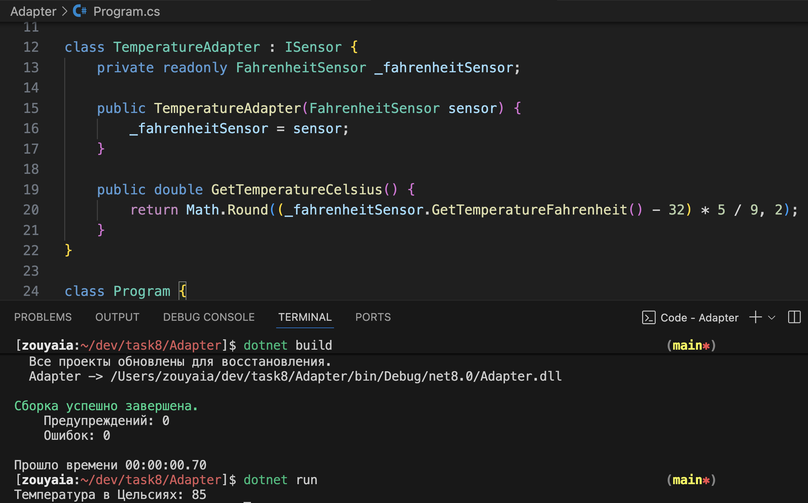
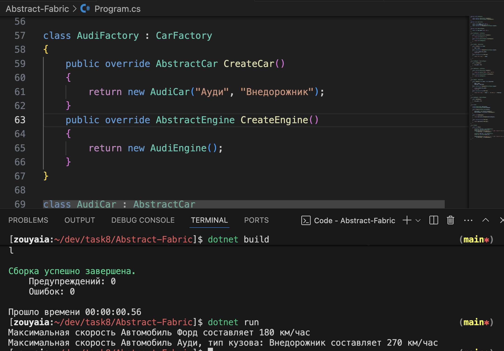
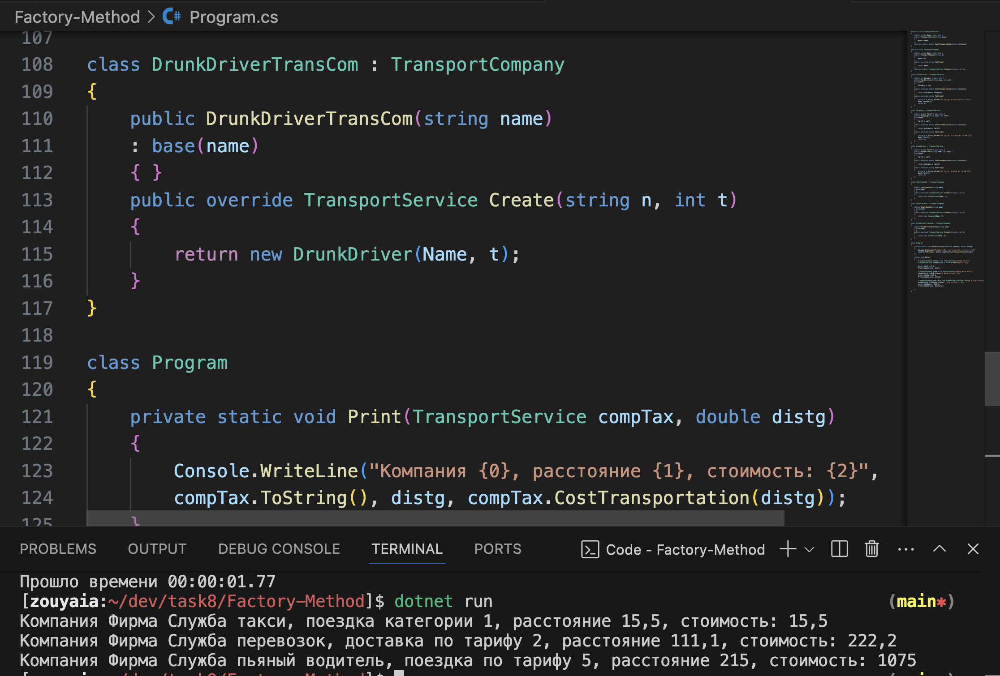
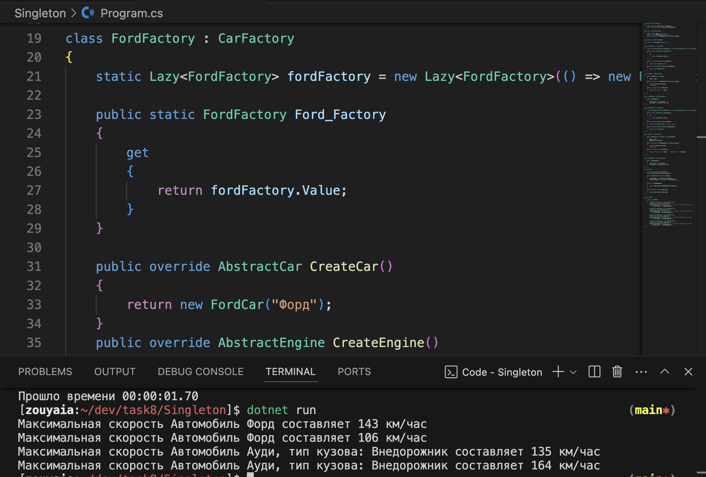
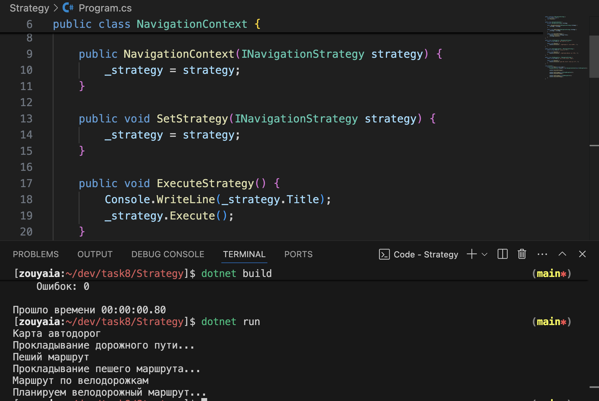
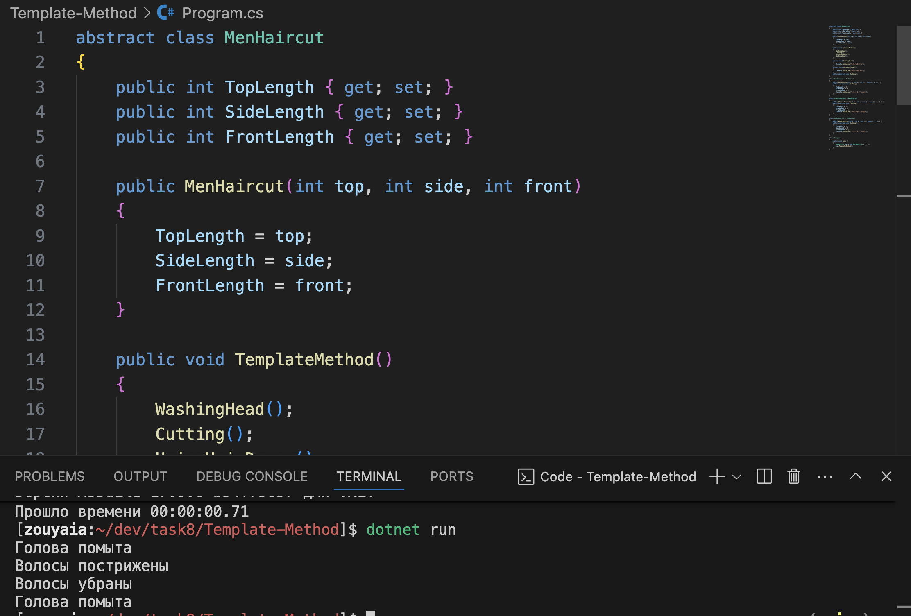
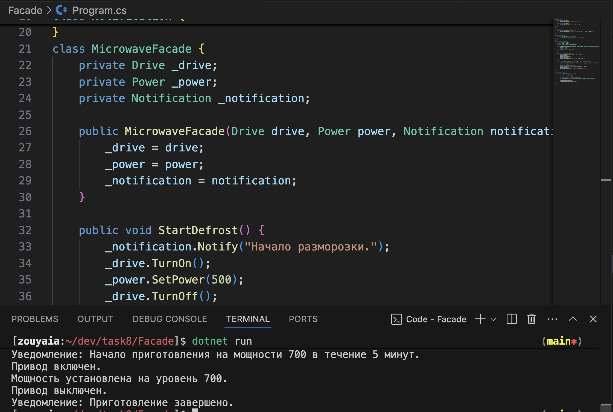
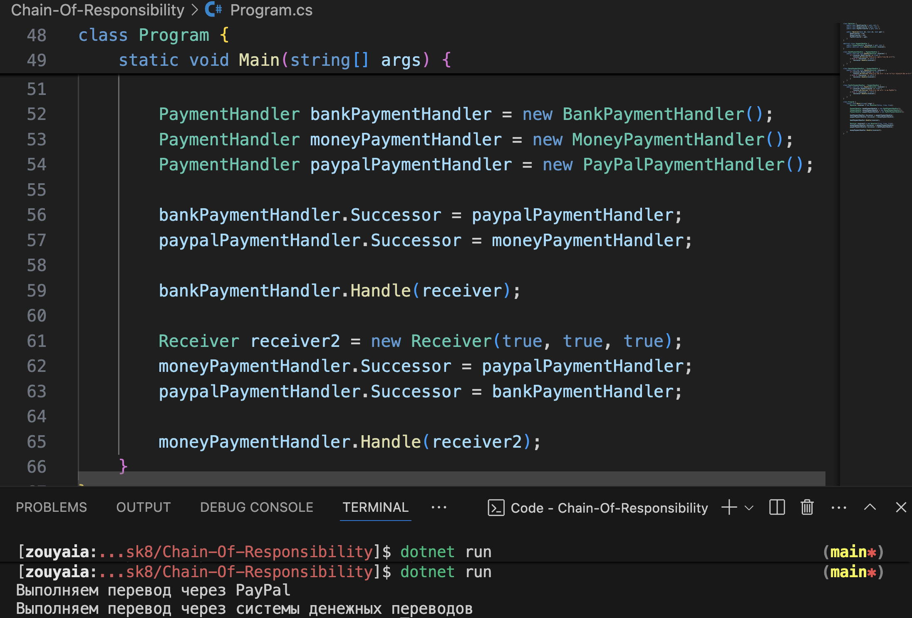
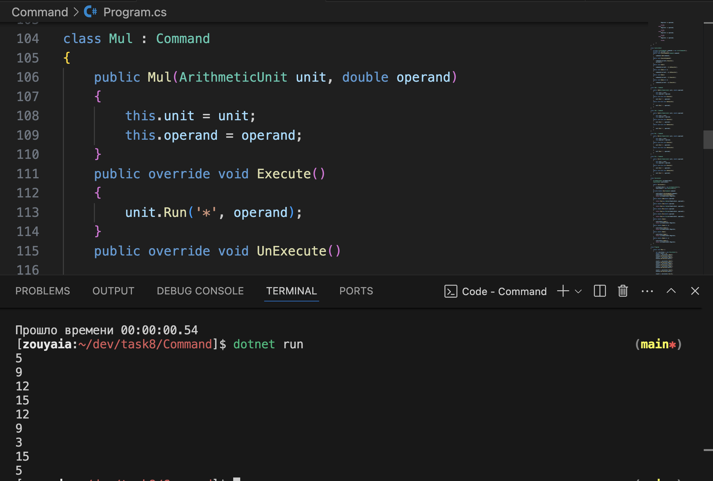
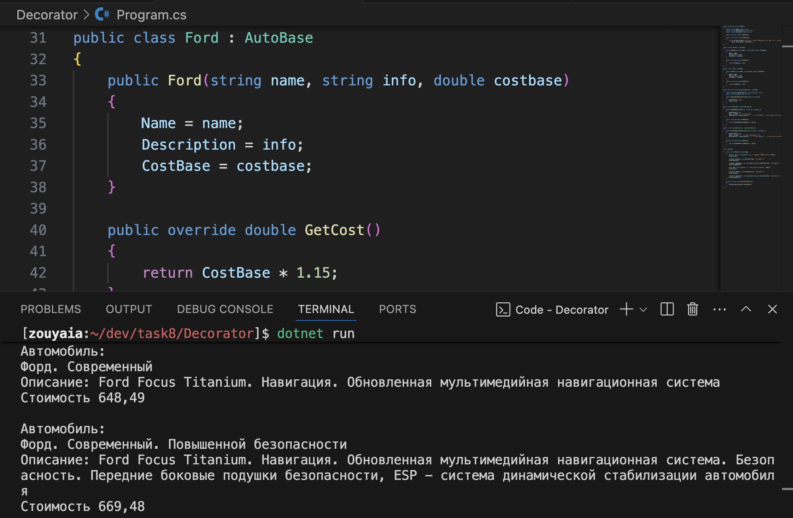

## Задание 8. Построение и исследование программной системы на основе шаблонов проектирования

### Цель:

Изучить шаблоны проектирования GoF и закрепить основы разработки
систем на их основе.

### Задание на выполнение практического занятия

1. Изучить шаблоны проектирования GoF, определить особенности их применения в программных системах.
1. Выполнить упражнения и контрольные задания руководства Шаблоны проектирования GoF.

### Результаты выполнения

### 1. **Adapter**

Шаблон Adapter применяется, когда нужно преобразовать один интерфейс в другой, который требуется программе.

В этой задаче адаптер использовался для преобразования температуры в шкалу Цельсия.

Этот шаблон полезен, когда существует потребность интегрировать устаревшие компоненты с новыми системами без внесения изменений в исходный код. Адаптер значительно упрощает взаимодействие между различными частями системы, которые используют разные форматы данных.

### 2. **Abstract Factory**

Шаблон Abstract Factory полезен в случаях, когда нужно создать семействo взаимосвязанных объектов, но их конкретные реализации могут изменяться.

В контрольном задании Abstract Factory использовался для создания новых автомобилей, а именно Audi, с различными типами кузова. Подход упрощает добавление новых автомобилей и конфигураций, минимизируя необходимость изменения существующего кода.

### 3. **Factory Method**

Шаблон Factory Method полезен, когда нужно делегировать создание объектов подклассам, чтобы они могли создать экземпляры с различными параметрами.

В контрольной задаче Factory Method использовался для добавления новой услуги  "пьяного водителя".

Шаблон позволяет создать систему с расширяемыми объектами, которые могут быть созданы в зависимости от условий или пользовательских предпочтений, не затрагивая основные структуры системы. Такой подход делает программу более гибкой и облегчает добавление новых функциональностей.

### 4. **Singleton**

Шаблон Singleton гарантирует, что класс будет иметь только один экземпляр, и предоставляет глобальную точку доступа к этому экземпляру.

В задаче Singleton использовался для реализации конкретной фабрики приложении Abstract Factory. Паттер полезен, когда требуется централизованное управление созданием объектов и ограничение на создание нескольких экземпляров фабрики. 

### 5. **Strategy**

Шаблон Strategy полезен для организации взаимозаменяемых алгоритмов, которые могут быть выбраны и применены в зависимости от контекста.

В задаче шаблон использовался для проектирования сложного алгоритма приложения навигатора. Можно легко добавить показывать карту, реализовывать поиск и прокладку различных типов маршрутов (автодороги, пешеходные маршруты, велодорожки и общественный транспорт) без изменения основного кода.

### 6. **Template Method**

Шаблон Template Method используется, когда необходимо определить общий алгоритм с возможностью изменения отдельных шагов в подклассах.

В контрольном задании Template Method использовался для проектирования алгоритма стрижки. Шаблон помог выделить стандартные шаги, такие как подготовка и завершение процедуры, в один базовый класс, оставив изменяемыми шаги, связанные с выбором стрижки или техники работы.

### 7. **Facade**

Шаблон Facade предоставляет упрощенный интерфейс для работы с комплексными системами.

Этот шаблон использовался для добавления метода приготовления продукта в класс-фасад. Это позволило скрыть сложные детали внутренней работы и предоставить пользователю простой способ взаимодействия с системой.

### 8. **Chain of Responsibility**

Шаблон Chain of Responsibility позволяет передавать запросы по цепочке объектов-обработчиков.

В задании он использовался для изменения последовательности объектов-обработчиков в цепочке, что позволило изменить логику обработки запросов в системе платежей. Шаблон позволяет динамически изменять логику обработки без изменения кода каждого обработчика.

### 9. **Command**

Шаблон помогает инкапсулировать запросы как объекты, что позволяет работать с ними как с данными, передавая, отменяя или записывая их для последующего выполнения.

Этот шаблон использовался для добавления новых операций (вычитание, умножение и деление) в калькулятор. Можно легко добавлять новые команды и их параметры, а также управлять последовательностью операций, что делает приложение более расширяемым и удобным в управлении.

### 10. **Decorator**

Шаблон Decorator используется для динамического расширения функциональности объектов без изменения их исходной структуры.

В задании Decorator был использован для добавления нового класса Ford и нескольких функциональных возможностей, без необходимости модификации существующих классов.

### Заключение:
Каждый шаблон проектирования решает специфическую задачу и обеспечивает различные преимущества, такие как гибкость, расширяемость и улучшение организации кода. Шаблоны, такие как "Decorator" и "Command", позволяют динамически менять поведение объектов, в то время как "Abstract Factory" и "Singleton" помогают организовать создание объектов с возможностью централизованного управления. Использование этих шаблонов в приложениях упрощает поддержку, делает код более гибким и снижает сложность при добавлении новых функциональностей или изменении существующих.
